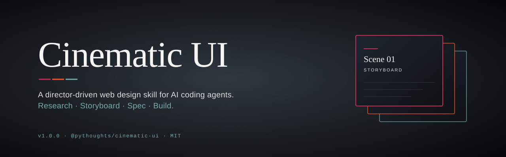

# Cinematic UI

<p align="center">
  
</p>

<p align="center">
  <a href="https://www.npmjs.com/package/@pythoughts/cinematic-ui"></a>
  <a href="https://www.npmjs.com/package/@pythoughts/cinematic-ui"></a>
  <a href="./LICENSE"></a>
  <a href="./SKILL.md"></a>
</p>

<p align="center">
  
  
  
  
  
  
</p>

---

A reasoning-first web design skill for AI coding agents. Teaches the agent to
think like a film director — research a real director and film, extract
cinematic grammar, translate it into page narrative, composition, and motion.
Not a style picker. A director's workflow.

- **Skill name:** `cinematic-ui`
- **npm package:** [`@pythoughts/cinematic-ui`](https://www.npmjs.com/package/@pythoughts/cinematic-ui)
- **Repository:** [github.com/Pythoughts-labs/cinematic-ui](https://github.com/Pythoughts-labs/cinematic-ui)
- **Author & Maintainer:** Mohamed Elkholy (`@Pythoughts`)
- **License:** MIT

---

## What this is

`cinematic-ui` is a reusable skill package for Claude Code, Codex, Cursor,
Windsurf, Gemini, and GitHub Copilot. It guides an agent through a fixed
workflow to design a website:

1. Pick a director + a specific film.
2. Research the film's language (cinematography, light, pacing, texture).
3. Translate the research into web artifacts: `decisions.md`, `storyboard.md`, `compiled-spec.md`.
4. Implement HTML / CSS / JS against the spec.

The film is **research material**, not a design spec sheet. The agent's job is
to extract structural patterns from the film and translate them into layout,
composition, motion, and typography.

---

## Workflow

| Phase | Work | Output |
|-------|------|--------|
| Phase 1 | Start questionnaire, pick director + film, uniqueness audit, research | `decisions.md` |
| Phase 2 | Site-wide cinematic grammar, per-page scene thesis, signature compositions | `storyboard.md` |
| Phase 3 | Shots, interactions, composition, texture, typography (per storyboard) | `compiled-spec.md` |
| Phase 4 | Implement, fill in reduced-motion + responsive, run anti-garbage checks | HTML / CSS / JS |

Phase 2 internal order is fixed: site-wide grammar → per-page thesis →
per-page composition → shared system last.

---

## Supported agents

| Agent | Entry file | Install path |
|-------|------------|--------------|
| Claude Code | [`CLAUDE.md`](./CLAUDE.md) | `~/.claude/skills/cinematic-ui` |
| Codex / ChatGPT | [`CODEX.md`](./CODEX.md) | `$CODEX_HOME/skills/cinematic-ui` |
| Cursor | [`.cursor/rules/cinematic-ui.mdc`](./.cursor/rules/cinematic-ui.mdc) | auto-loaded on clone |
| Windsurf | [`.windsurf/rules/cinematic-ui.md`](./.windsurf/rules/cinematic-ui.md) | auto-loaded on clone |
| GitHub Copilot | [`.github/copilot-instructions.md`](./.github/copilot-instructions.md) | auto-loaded on clone |
| Gemini / Antigravity | [`GEMINI.md`](./GEMINI.md) | read at project start |
| Cross-tool | [`AGENTS.md`](./AGENTS.md) | shared reference |

---

## Installation

### npm (all platforms)

```bash
npm install -g @pythoughts/cinematic-ui
```

The package contents are then at `$(npm root -g)/@pythoughts/cinematic-ui/`.
Copy or symlink the files into the target agent's skills/rules folder. Example
for Claude Code:

```bash
PKG=$(npm root -g)/@pythoughts/cinematic-ui
ln -s "$PKG" ~/.claude/skills/cinematic-ui
```

Invoke with `/cinematic-ui` inside Claude Code.

### Git (Claude Code)

**Windows:**
```powershell
git clone https://github.com/Pythoughts-labs/cinematic-ui "$env:USERPROFILE\.claude\skills\cinematic-ui"
```

**macOS / Linux:**
```bash
git clone https://github.com/Pythoughts-labs/cinematic-ui ~/.claude/skills/cinematic-ui
```

### Git (Codex / ChatGPT)

```bash
git clone https://github.com/Pythoughts-labs/cinematic-ui $CODEX_HOME/skills/cinematic-ui
```

### Git (Cursor / Windsurf / GitHub Copilot)

```bash
git clone https://github.com/Pythoughts-labs/cinematic-ui
```

Rule files are picked up automatically.

---

## Suggested prompt

```text
Use cinematic-ui to build a homepage.
Pick the director and film yourself.
Research the director and film first if web access is available.
Run the Demo Uniqueness Protocol.
Do not reuse shells from previous demos.
```

---

## Reference library

All reference data lives in `references/`, organized by phase. Load only what
the current phase needs.

### Core rule files

| File | Purpose |
|------|---------|
| [`references/library-index.md`](./references/library-index.md) | Which files to read at each phase |
| [`references/premium-calibration.md`](./references/premium-calibration.md) | Post-brief self-check |
| [`references/anti-garbage.md`](./references/anti-garbage.md) | Common AI design degradation patterns |
| [`references/anti-convergence.md`](./references/anti-convergence.md) | Hash-based selection to prevent repeated shells |
| [`references/implementation-guardrails.md`](./references/implementation-guardrails.md) | Phase 3–4 build rules |
| [`references/reference-protocol.md`](./references/reference-protocol.md) | Decompose references without copying |
| [`references/output-templates.md`](./references/output-templates.md) | Standard artifact formats per phase |

### Data libraries

| File | Contents |
|------|----------|
| `references/data/directors-200.md` | 200+ directors with representative films and visual style |
| `references/data/hero-archetypes.md` | 30 hero skeletons |
| `references/data/narrative-beats.md` | 25 narrative beats + 18 director arc templates |
| `references/data/section-functions.md` | 50 functional section types |
| `references/data/section-archetypes.md` | 91+ section skeletons |
| `references/data/dna-index.tsv` | 1,486-site design DNA index |
| `references/data/design-dna-db.txt` | Site-level DNA data |
| `references/data/camera-shots-50.md` | 55 entrance and reveal motion patterns |
| `references/data/interaction-effects-50.md` | 55+ hover / click / scroll interactions |
| `references/data/compositions.md` | 80 layout compositions |
| `references/data/visual-elements.md` | 40 decorative visual elements |
| `references/data/background-techniques.md` | 50+ hero background techniques |
| `references/data/typography-cinema.md` | 40+ typography treatments |
| `references/data/color-grades.md` | 40+ film color grade → UI token translations |
| `references/data/font-moods.md` | 30+ font pairings by mood |
| `references/data/textures.md` | 30+ surface texture techniques |

---

## Repository layout

```text
cinematic-ui/
├── SKILL.md                        ← main skill logic
├── skill.json                      ← cross-agent skill manifest
├── package.json                    ← npm package metadata
├── CLAUDE.md                       ← Claude Code
├── AGENTS.md                       ← cross-tool shared reference
├── CODEX.md                        ← Codex / ChatGPT
├── GEMINI.md                       ← Gemini / Antigravity
├── .cursor/rules/                  ← Cursor (auto-loaded)
├── .windsurf/rules/                ← Windsurf (auto-loaded)
├── .github/copilot-instructions.md ← GitHub Copilot (auto-loaded)
├── agents/openai.yaml              ← OpenAI skill metadata
└── references/
    ├── library-index.md
    ├── premium-calibration.md
    ├── anti-garbage.md
    ├── anti-convergence.md
    ├── implementation-guardrails.md
    ├── reference-protocol.md
    ├── output-templates.md
    └── data/                       ← 16 design data libraries
```

---

## Publishing

This skill is published as a scoped npm package under the `pythoughts` npm org
(same maintainer as `@pythoughts/react-frontend-skills`). The owner publishes with:

```bash
npm login
npm publish --access public
```

`--access public` is required because `@pythoughts/cinematic-ui` is a scoped
package.

---

## Contributing

See [CONTRIBUTING.md](./CONTRIBUTING.md).

## License

MIT. See [LICENSE](./LICENSE).
